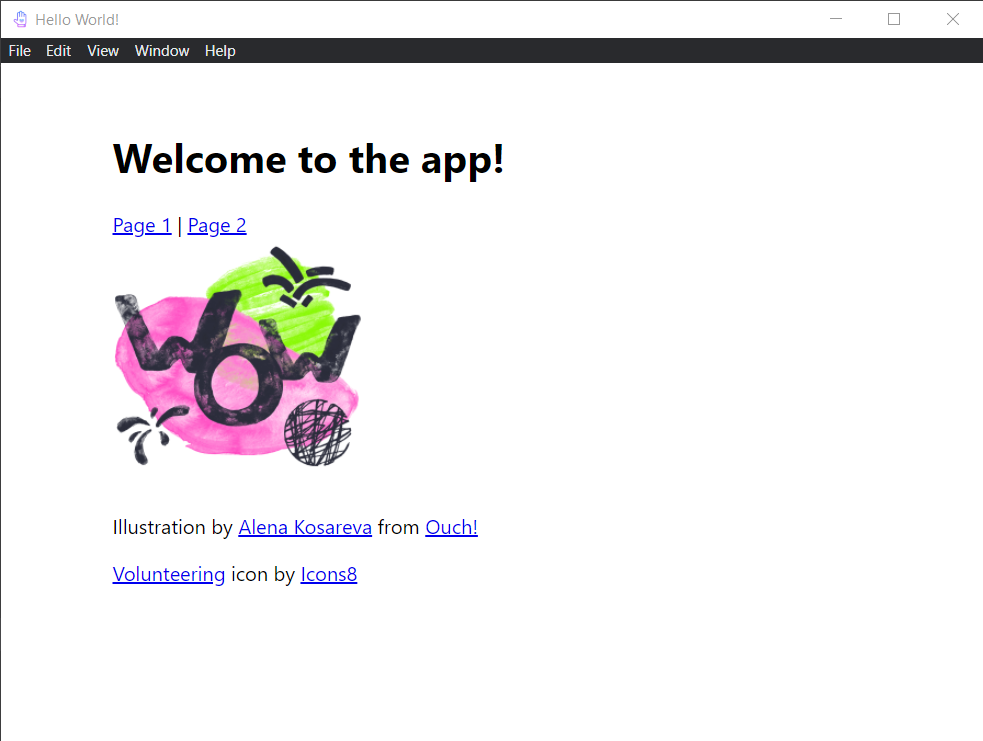

# electron-app-react-ts

Electron app with React and Typescript set up using [Electron Forge](https://www.electronforge.io). Features include,

* Typescript
* React, including React Router
* SASS stylesheet
* Static assets



## Prerequisites

* [Node LTS](https://nodejs.org/en/download/)

## Development

For first time usage, run:

```
npm install
```

Execute the following for development and production respectively,

```
npm start
npm run make
```

## Steps for setting up this project

### 1. Initialize Electron app with Typescript and Webpack

Create a new Electron app with TypeScript and Webpack using the [built-in template](https://www.electronforge.io/templates/typescript-+-webpack-template):

```
npx create-electron-app my-new-app --template=typescript-webpack
```

Now, navigate to the project root directory, and executing:

```
npm start
```

... you will be prompted with a window of your Electron app, including a Dev Tool, which is super useful for development!

We however do not want the Dev Tool to be visible for production release. Therefore, we adjust the setting in `src/index.ts` to have the `openDevTools()` executed only in development mode,

```tsx
// src/index.ts

const isProduction = process.env.NODE_ENV === 'production';

const createWindow = (): void => {
  ...

  // Open the DevTools.
  isProduction
  ? null
  : mainWindow.webContents.openDevTools();
```

We also need to set up the environmental variable using `cross-env`:

```
npm install --save-dev cross-env
```

```json
// package.json
{
  ...
  "scripts": {
    "start": "electron-forge start",
    "package": "cross-env NODE_ENV=production electron-forge package",
    "make": "cross-env NODE_ENV=production electron-forge make",
    "publish": "cross-env NODE_ENV=production electron-forge publish",
    "lint": "eslint --ext .ts,.tsx ."
  },
  ...
}
```

### 2. Install React

Follow the official Electron Forge guide on integrating [React with TypeScript](https://www.electronforge.io/guides/framework-integration/react-with-typescript), add the React packages by running,

```
npm install --save react react-dom
npm install --save-dev @types/react @types/react-dom
```

Adjust Typescript configuration accordingly,

```json
// tsconfig.json

{
  "compilerOptions": {
    "jsx": "react",
    ...
  }
}
```

Create a minimum React component in `src/app.tsx`, and import it to the end of `src/render.ts`:

```ts
// src/render.ts

// Add this to the end of the existing file
import './app';
```

Instead of injecting React components directly into `document.body` (which is a bad practice), we have them `render()` into a container element:

```html
<!-- index.html -->

  <body>
--    <h1>💖 Hello World!</h1>
--    <p>Welcome to your Electron application.</p>
++    <div id="app"></div>
  </body>
```

```tsx
// app.tsx

function render() {
  ReactDOM.render(<App />, document.getElementById('app'));
}
```

### 3. Set up React Router

Install React Router by running:

```
npm install react-router-dom
```

Follow the instructions in [React Router](https://reactrouter.com/docs/en/v6/getting-started/overview#configuring-routes) documentation, replace `App()` with the router setup using `<HashRouter>`,

```tsx
// app.tsx

function App() {
  return (
    <HashRouter>
      <Routes>
        <Route path="/" element={<Layout />}>
          <Route path="page1" element={<Page1 />} />
          <Route path="page2" element={<Page2 />} />
        </Route>
      </Routes>
    </HashRouter>
  );
}

// ... and set up other components accordingly ...
```

### 4. Using Sass stylesheet

Follow the instructions below to use a scss/sass stylesheet for app development:

```
npm install --save-dev sass sass-loader
```

```js
// webpack.main.config.js

module.exports = {
  ...
  resolve: {
    extensions: ['.js', '.ts', '.jsx', '.tsx', '.css', '.json', '.scss', '.sass']
  },
};
```

```js
// webpack.renderer.config.jx

rules.push({
  test: /\.(sass|scss|css)$/,
  use: [
    { loader: 'style-loader' },
    { loader: 'css-loader' },
    { loader: 'sass-loader' },
  ],
});
```

Now, rename `index.css` as `index.sass` and adjust the syntax in the file. Don't forget to import the `.sass` stylesheet instead in `renderer.ts` too:

```ts
// renderer.ts

-- import './index.css';
++ import './index.sass';
```

### 5. Serving static assets

Say we'd like to add a static image in our app, serving from the directory `src/assets/images` with something like:

```tsx
// app.tsx

    
```

... you'd notice that, after running `npm start`, the image is not properly rendered. That is because the assets are not correctly set to be bundled with Webpack.

We fix this by using `copy-webpack-plugin`:

```
npm install --save-dev copy-webpack-plugin
```

... and set up the plugin configuration in `webpack.plugins.js`. Note here that we again apply different settings for development and production mode using environmental variable that we set up earlier using `cross-env`.

```js
// webpack.plugins.js

const path = require('path');
const ForkTsCheckerWebpackPlugin = require('fork-ts-checker-webpack-plugin');
const CopyWebpackPlugin = require('copy-webpack-plugin');

const isProduction = process.env.NODE_ENV === 'production';

module.exports = [
  new ForkTsCheckerWebpackPlugin(),
  new CopyWebpackPlugin({
    patterns: [
      {
        from: path.resolve(__dirname, 'src/assets/'),
        to: isProduction
          ? path.resolve(__dirname, '.webpack/renderer/main_window/assets/')
          : path.resolve(__dirname, '.webpack/renderer/assets/')
      },
    ]
  })
];
```

### 6. Configure app icon

Finally, why not have an icon for our application?

We can set this up in `package.json` with the configuration for [Electron Packager](https://electron.github.io/electron-packager/main/interfaces/electronpackager.options.html#icon):

```json
// package.json
{
  ...
  "config": {
    "forge": {
      "packagerConfig": {
        "icon": "src/assets/favicon.ico"
      },
      ...
}
```

Now, run `npm run make` to generate your desktop application. You can find the outcome in the directory `./out`. And the app now comes with the icon specified!
